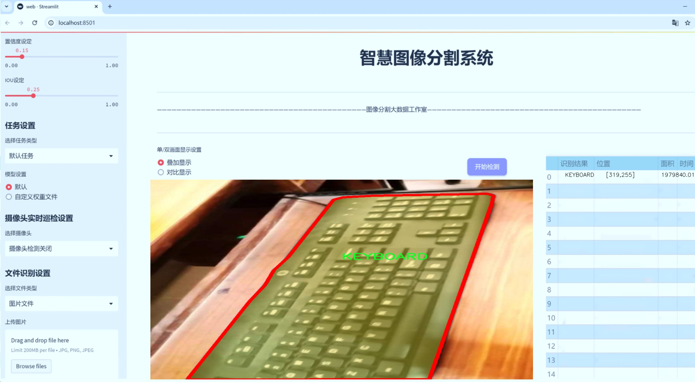
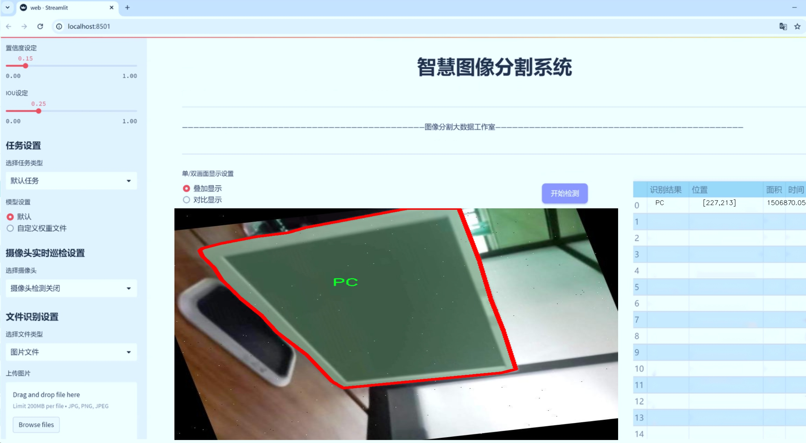
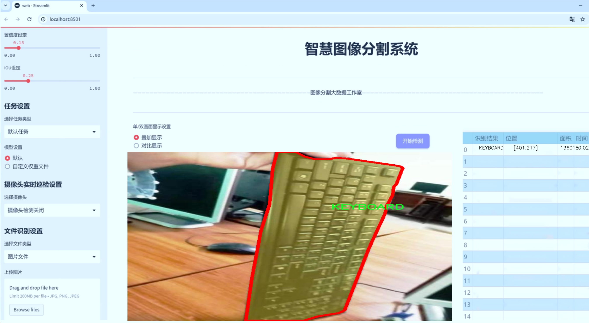
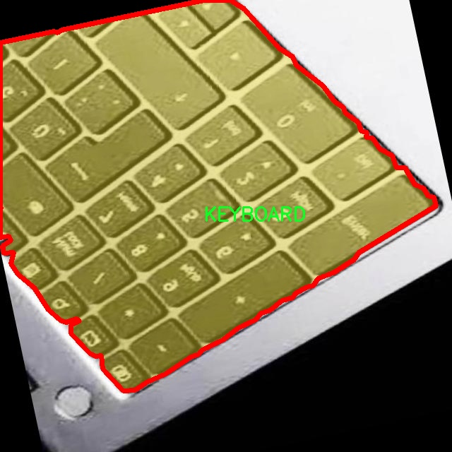
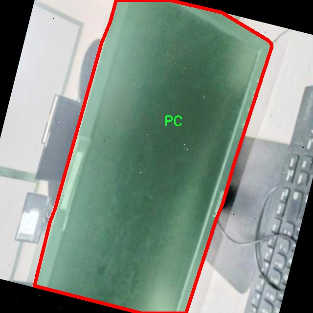
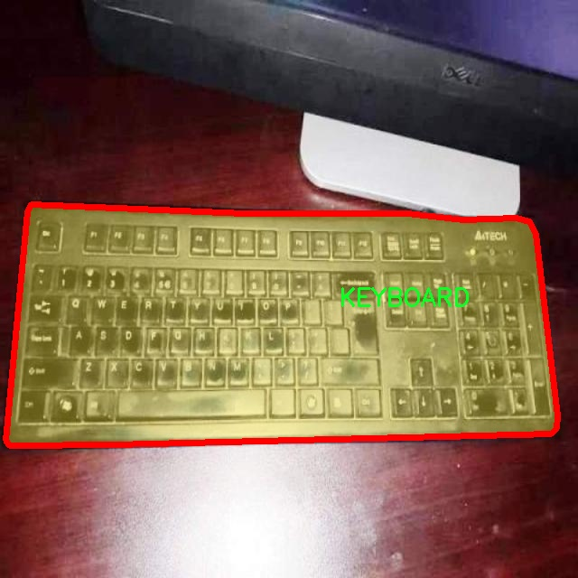
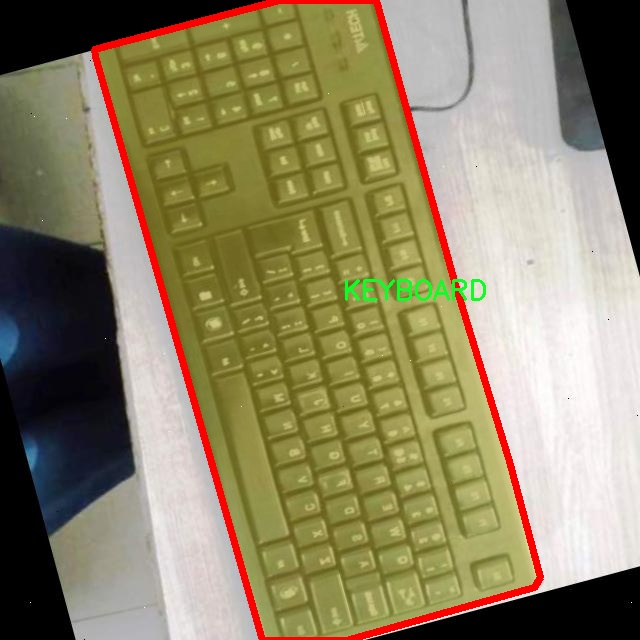
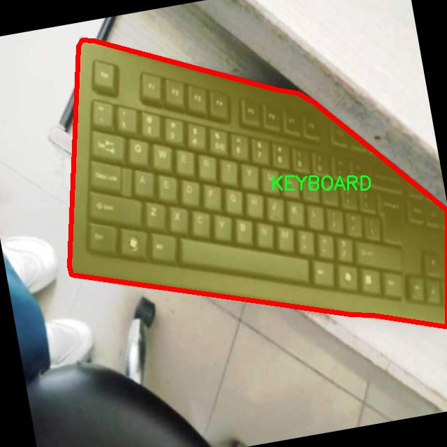

# 计算机外设分割系统源码＆数据集分享
 [yolov8-seg-CSwinTransformer＆yolov8-seg-rtdetr等50+全套改进创新点发刊_一键训练教程_Web前端展示]

### 1.研究背景与意义

项目参考[ILSVRC ImageNet Large Scale Visual Recognition Challenge](https://gitee.com/YOLOv8_YOLOv11_Segmentation_Studio/projects)

项目来源[AAAI Global Al lnnovation Contest](https://kdocs.cn/l/cszuIiCKVNis)

研究背景与意义

随着信息技术的迅猛发展，计算机外设的应用场景日益广泛，涵盖了办公、游戏、设计等多个领域。计算机外设，如键盘、鼠标和个人计算机（PC），在日常工作和生活中扮演着不可或缺的角色。为了提升用户体验和操作效率，计算机外设的智能识别与分割技术逐渐成为研究的热点。传统的图像处理方法在复杂环境下的表现往往不尽如人意，因此，基于深度学习的目标检测与分割技术应运而生，尤其是YOLO（You Only Look Once）系列模型，以其高效性和准确性受到广泛关注。

YOLOv8作为YOLO系列的最新版本，具备了更强的特征提取能力和更快的推理速度，适用于实时应用场景。然而，针对特定领域的计算机外设分割任务，YOLOv8的标准模型可能无法完全满足需求。因此，改进YOLOv8以适应计算机外设的特征，将是提升分割精度和效率的关键所在。通过对YOLOv8进行优化，可以更好地处理计算机外设在不同光照、角度和背景下的变化，从而实现更为精准的实例分割。

本研究所使用的数据集包含1700张图像，涵盖了三类计算机外设：键盘、鼠标和个人计算机。这一数据集的构建为模型的训练和评估提供了坚实的基础。每一类外设的多样性和复杂性，要求模型不仅能够识别外设的存在，还能够准确地分割出其轮廓和细节。这对于后续的应用，如自动化组装、智能监控以及人机交互等，具有重要的现实意义。

在实际应用中，计算机外设的分割不仅仅是识别物体，更涉及到对物体形状、位置和空间关系的理解。通过改进YOLOv8的算法，我们能够实现对外设的高效分割，从而为后续的图像分析、特征提取和智能决策提供支持。此外，研究成果还可以为相关领域的研究提供借鉴，推动计算机视觉技术在更广泛场景中的应用。

综上所述，基于改进YOLOv8的计算机外设分割系统的研究，不仅具有重要的理论价值，也具备显著的应用前景。通过深入探讨和优化现有的深度学习模型，我们希望能够在计算机外设的智能识别与分割领域取得突破，为智能化时代的到来贡献一份力量。

### 2.图片演示







##### 注意：由于此博客编辑较早，上面“2.图片演示”和“3.视频演示”展示的系统图片或者视频可能为老版本，新版本在老版本的基础上升级如下：（实际效果以升级的新版本为准）

  （1）适配了YOLOV8的“目标检测”模型和“实例分割”模型，通过加载相应的权重（.pt）文件即可自适应加载模型。

  （2）支持“图片识别”、“视频识别”、“摄像头实时识别”三种识别模式。

  （3）支持“图片识别”、“视频识别”、“摄像头实时识别”三种识别结果保存导出，解决手动导出（容易卡顿出现爆内存）存在的问题，识别完自动保存结果并导出到tempDir中。

  （4）支持Web前端系统中的标题、背景图等自定义修改，后面提供修改教程。

  另外本项目提供训练的数据集和训练教程,暂不提供权重文件（best.pt）,需要您按照教程进行训练后实现图片演示和Web前端界面演示的效果。

### 3.视频演示

[3.1 视频演示](https://www.bilibili.com/video/BV1PPmPYCEqh/)

### 4.数据集信息展示

##### 4.1 本项目数据集详细数据（类别数＆类别名）

nc: 3
names: ['KEYBOARD', 'MOUSE', 'PC']


##### 4.2 本项目数据集信息介绍

数据集信息展示

在计算机视觉领域，数据集的构建与选择是影响模型性能的关键因素之一。本研究所使用的数据集名为“COMPUTER MODEL detection”，专门针对计算机外设的分割任务而设计。该数据集的主要目标是为改进YOLOv8-seg模型提供高质量的训练数据，从而提升其在计算机外设分割方面的精度和效率。

“COMPUTER MODEL detection”数据集包含三类主要对象，分别是键盘（KEYBOARD）、鼠标（MOUSE）和个人计算机（PC）。这三类对象在现代计算环境中具有重要的应用价值，涵盖了用户与计算机交互的基本组成部分。数据集中每一类对象的图像均经过精心挑选和标注，确保在多样性和代表性方面达到较高标准。通过对不同品牌、型号和设计的外设进行采集，数据集能够有效地反映出市场上常见计算机外设的多样性。

在数据集的构建过程中，特别注重图像的质量和多样性。每一类外设的图像均来自于不同的拍摄环境，包括自然光照、人工光源、不同的背景等。这种多样化的图像来源使得模型在训练过程中能够学习到更为丰富的特征，从而提高其在实际应用中的泛化能力。此外，数据集中还包含了不同角度、不同距离和不同姿态下的外设图像，以便模型能够更好地理解和识别这些对象的形态特征。

为了确保数据集的标注准确性，采用了专业的标注工具和严格的标注流程。每张图像中的外设对象均经过人工精确标注，确保分割区域的边界清晰且准确。这种高质量的标注不仅有助于提升模型的训练效果，也为后续的评估和测试提供了可靠的基准。

在训练过程中，利用“COMPUTER MODEL detection”数据集对YOLOv8-seg模型进行优化，旨在提升其在计算机外设分割任务中的表现。通过对模型进行多轮训练和调优，期望能够实现更高的分割精度和更快的推理速度。数据集的多样性和高质量标注将为模型的学习提供丰富的特征信息，帮助其更好地应对复杂的分割任务。

总之，“COMPUTER MODEL detection”数据集为本研究提供了坚实的基础，涵盖了计算机外设的主要类别，并通过精细的标注和多样化的图像样本，为改进YOLOv8-seg模型的训练和应用奠定了良好的基础。随着模型的不断优化和数据集的深入挖掘，期望能够在计算机外设分割领域取得显著的进展，为相关应用提供更为精准和高效的解决方案。











### 5.全套项目环境部署视频教程（零基础手把手教学）

[5.1 环境部署教程链接（零基础手把手教学）](https://www.bilibili.com/video/BV1jG4Ve4E9t/?vd_source=bc9aec86d164b67a7004b996143742dc)


[5.2 安装Python虚拟环境创建和依赖库安装视频教程链接（零基础手把手教学）](https://www.bilibili.com/video/BV1nA4VeYEze/?vd_source=bc9aec86d164b67a7004b996143742dc)

### 6.手把手YOLOV8-seg训练视频教程（零基础小白有手就能学会）

[6.1 手把手YOLOV8-seg训练视频教程（零基础小白有手就能学会）](https://www.bilibili.com/video/BV1cA4VeYETe/?vd_source=bc9aec86d164b67a7004b996143742dc)


按照上面的训练视频教程链接加载项目提供的数据集，运行train.py即可开始训练



     Epoch   gpu_mem       box       obj       cls    labels  img_size
     1/200     0G   0.01576   0.01955  0.007536        22      1280: 100%|██████████| 849/849 [14:42<00:00,  1.04s/it]
               Class     Images     Labels          P          R     mAP@.5 mAP@.5:.95: 100%|██████████| 213/213 [01:14<00:00,  2.87it/s]
                 all       3395      17314      0.994      0.957      0.0957      0.0843

     Epoch   gpu_mem       box       obj       cls    labels  img_size
     2/200     0G   0.01578   0.01923  0.007006        22      1280: 100%|██████████| 849/849 [14:44<00:00,  1.04s/it]
               Class     Images     Labels          P          R     mAP@.5 mAP@.5:.95: 100%|██████████| 213/213 [01:12<00:00,  2.95it/s]
                 all       3395      17314      0.996      0.956      0.0957      0.0845

     Epoch   gpu_mem       box       obj       cls    labels  img_size
     3/200     0G   0.01561    0.0191  0.006895        27      1280: 100%|██████████| 849/849 [10:56<00:00,  1.29it/s]
               Class     Images     Labels          P          R     mAP@.5 mAP@.5:.95: 100%|███████   | 187/213 [00:52<00:00,  4.04it/s]
                 all       3395      17314      0.996      0.957      0.0957      0.0845


### 7.50+种全套YOLOV8-seg创新点代码加载调参视频教程（一键加载写好的改进模型的配置文件）

[7.1 50+种全套YOLOV8-seg创新点代码加载调参视频教程（一键加载写好的改进模型的配置文件）](https://www.bilibili.com/video/BV1Hw4VePEXv/?vd_source=bc9aec86d164b67a7004b996143742dc)

### 8.YOLOV8-seg图像分割算法原理

原始YOLOv8-seg算法原理

YOLOv8-seg算法是YOLO系列模型中的最新版本，继承并扩展了前几代模型的优点，特别是在目标检测和分割任务中表现出色。YOLOv8的设计理念在于通过高效的网络结构和先进的训练策略，实现快速且高精度的目标检测与分割。该算法的核心在于其独特的网络架构，主要由Backbone、Neck和Head三部分组成，形成了一个高效的特征提取和处理系统。

首先，Backbone部分是YOLOv8-seg的基础，负责从输入图像中提取多层次的特征。与以往的YOLO版本相比，YOLOv8的Backbone采用了更深的卷积神经网络结构，结合了残差连接和瓶颈结构，显著提高了特征提取的效率和准确性。具体而言，Backbone使用了一系列的卷积层和反卷积层，形成了一个高效的特征提取模块。C2模块作为基本构成单元，确保了特征提取的深度和广度。同时，Backbone中引入的快速空间金字塔池化（SPPF）模块，能够有效地捕捉不同尺度的特征信息，为后续的目标检测和分割提供了丰富的上下文信息。

接下来，Neck部分的设计旨在实现多尺度特征的融合，以提高模型对不同尺寸目标的检测能力。YOLOv8-seg通过整合来自Backbone不同层次的特征图，采用特征金字塔网络（FPN）技术，使得模型能够在多个尺度上进行有效的特征融合。这种多尺度特征融合不仅增强了模型对小目标的检测能力，还提高了整体的鲁棒性，使得YOLOv8-seg在复杂场景下的表现更加出色。

最后，Head部分是YOLOv8-seg的预测端，负责将经过Neck处理的特征图转化为最终的检测和分割结果。YOLOv8-seg设有三个解耦的检测头，分别针对不同尺寸的目标进行处理。这些检测头通过一系列的卷积层和反卷积层，生成目标的边界框和类别信息，同时还能够输出每个像素的分割信息。这样的设计使得YOLOv8-seg不仅能够进行目标检测，还能够实现精细的实例分割，满足了多种应用场景的需求。

在模型设置方面，YOLOv8-seg引入了depth_factor、width_factor和ratio等参数，以便用户根据具体需求灵活调整模型的深度和宽度。通过调整这些参数，用户可以根据硬件资源和应用场景的不同，选择合适的模型结构，从而实现更高的推理速度和更优的检测精度。这种灵活性使得YOLOv8-seg能够广泛应用于智能监控、自动驾驶、人脸识别等多个领域，展现出极大的应用潜力。

值得一提的是，YOLOv8-seg在训练过程中采用了多种先进的技术，如多尺度训练和数据增强策略，以进一步提升模型的性能。通过在不同的尺度上进行训练，模型能够更好地适应各种尺寸的目标，增强了其泛化能力。此外，YOLOv8-seg还支持自定义数据集的训练，使得用户可以根据特定的应用需求，快速构建和优化自己的目标检测和分割模型。

总的来说，YOLOv8-seg算法通过其创新的网络结构和灵活的模型设置，显著提升了目标检测和分割的性能。其在速度和精度上的优越表现，使其成为当前业界最流行和成功的目标检测算法之一。随着YOLOv8-seg的不断发展和优化，未来在更多实际应用中，我们可以期待其带来更高效、更智能的解决方案。


### 9.系统功能展示（检测对象为举例，实际内容以本项目数据集为准）

图9.1.系统支持检测结果表格显示

  图9.2.系统支持置信度和IOU阈值手动调节

  图9.3.系统支持自定义加载权重文件best.pt(需要你通过步骤5中训练获得)

  图9.4.系统支持摄像头实时识别

  图9.5.系统支持图片识别

  图9.6.系统支持视频识别

  图9.7.系统支持识别结果文件自动保存

  图9.8.系统支持Excel导出检测结果数据


### 10.50+种全套YOLOV8-seg创新点原理讲解（非科班也可以轻松写刊发刊，V11版本正在科研待更新）

#### 10.1 由于篇幅限制，每个创新点的具体原理讲解就不一一展开，具体见下列网址中的创新点对应子项目的技术原理博客网址【Blog】：


[10.1 50+种全套YOLOV8-seg创新点原理讲解链接](https://gitee.com/qunmasj/good)

#### 10.2 部分改进模块原理讲解(完整的改进原理见上图和技术博客链接)【如果此小节的图加载失败可以通过CSDN或者Github搜索该博客的标题访问原始博客，原始博客图片显示正常】
### YOLOv8简介
在各种目标检测算法中，YOLO系列因其速度和准确度间的优异平衡脱颖而出，能够准确、快速的识别目标，便于部署到各种移动设备中，已经广泛应用于各种领域的目标检测、跟踪和分割。目前最新版本 YOLOv8由原v5的开发团队Ultralytics于2023年1月提出，按规格大小可划分为n、s、m、1和x5个版本，是目前最先进的目标检测算法，有着优异的性能，很适合用于无人机航拍图像目标检测。其网络结构如图所示。

YOLOv8模型包括Input、Backbone、Neck 和Head4部分。其中 Input选用了Mosaic数据增强方法，并且对于不同大小的模型，有部分超参数会进行修改，典型的如大模型会开启 MixUp 和CopyPaste数据增强，能够丰富数据集，提升模型的泛化能力和鲁棒性。Backbone主要用于提取图片中的信息，提供给Neck和Head使用，由多个Conv、C2f模块和尾部的SPPF组成。Conv模块由单个Conv2d、
BatchNorm2d和激活函数构成,用丁是双行在万E5特征图;YOLOv8参考了C3模块的残左绒以心YOLOv7[16l的ELAN思想，设计出了C2f 结构，可以在保证轻量化的同时获得更加丰富的梯度流信息，并根据模型尺度来调整通道数，大幅提升了模型性能;SPPF是空间金字塔池化，能够融合不同尺度的特征。Neck部分主要起特征融合的作用，充分利用了骨干网络提取的特征，采用FPN[17]+PAN[18〕结构，
能够增强多个尺度上的语义表达和定位能力。Head输出端根据前两部分处理得到的特征来获取检测目标的类别和位置信息，做出识别,换以小旦公来和定解耦头结构,将分类和检测头分:9w‘无锅框的位关注侧重点不同的问题，同时也采用了无锚框的目标检测（Anchor-Free)，能够提升检测速度。Loss计算方面采用了正负样本动态分配策略，使用 VFLLoss 作为分类损失，使用DFLLoss+CIOU Loss作为回归损失。

### AutoFocus: Efficient Multi-Scale Conv简介

参考该博客提出了AutoFocus，一种高效的多尺度目标检测算法。相较于以前对整个图像金字塔进行处理，该方法以一种由表及里的姿态，仅处理哪些整体上看来很有可能存在小物体的区域。这个可以通过预测一张类别未知的分割图FocusPixels来得到。为了高效利用FocusPixels，另外一个算法用于产生包含FocusPixels的FocusChips，这样可以减少计算量并处理更更精细的尺度。在不同尺度上FocusChips所得到的检测结果综合时，会出现问题，我们也提供了解决问题的方案。AutoFocus在COCO上的结果有49.7%mAP（50%重叠下68.3%），与多尺度baseline相仿但是快了2.5倍。金字塔中处理的像素数量减少了5倍mAP只下降1%，在与RetinaNet采用相同的ResNet-101结构且速度相同时，高了10%mAP。

人类寻找物体是一个动态的过程，且寻找时间与场景的复杂度是直接相关的。当我们的眼神在不同的点之间漂移时，其他的区域会被我们有意忽视。然而，现在的检测算法是一种静态的推理过程且图像金字塔中的每个像素都受到了一样的对待，这使得过程变得没有效率。现在许多的应用都不强调实时性，而计算上的节省其实可以产生很大收益。

在COCO数据集中，虽然40%的物体都是小物体，但是它们一共只占了全图的0.3%。如果金字塔是3倍关系，则在高分辨率层要进行9倍的运算。XXX 。那么有没有办法在低分辨率下找出可能含有这些物体的区域呢？

以人眼方案类比，我们可以从低分辨率图像开始，找出有可能存在物体的区域再“聚集”到高分辨率。我们的AutoFocus会在一层中计算小物体的分割图FocusPixels，而在每一个FocusPixels上会用一个算法产生下一层所需要关注的chips。在COCO的最大分辨率层上我们可以只处理**20%的像素而性能不下降，如果只处理5%**也只下降1%而已。


图像金字塔与卷积神经网络对CV十分重要。然而卷积神经网络无法做到对尺度不敏感，所以为了不同大小的物体需要依赖图像金字塔。虽然训练已经有了高效的方法，但是其推断时间依然远离实际使用标准。

目标检测加速有很长历史了。常用的有特征近似以减少尺度、级联、特征金字塔，且最后一个最近很多人研究。

AutoFocus为速度与精度之间提供了一个平滑的折衷，指出可以在低分辨率下看出小物体的所在，从而节约计算。FocusPixels的计算较为容易。

先简单介绍一下SNIP，是一种多尺度的训练、推断算法。主要思想是训练针对某个特定scale的检测器而不是scale-invariant检测器。这样训练样本就局限于在某个尺度范围内，以适于这个检测器处理。比如在高分辨率仅处理小物体而高分辨率仅处理大物体，其优势在于训练时不用考虑尺度的变化。

由于训练时物体大小是已知的，我们在图像金字塔中可以忽略大量区域而只处理物体周围的区域。SNIPER说明这样低分辨率的训练与全图训练相比并不会降低性能。同样，在推断过程中如果可以在大分辨率图像上预测可能出现小物体的chip，我们也就不用处理整张高分辨率图片。在训练时，许多物体会被裁剪、扭曲，这可以当作是一种数据扩增，然而当这个情况在推断时出现，则会产生错误，所以我们还需要一个算法来整合不同尺度上的检测结果。

#### AutoFocus框架
如SIFT、SURF等传统分类特征包含两个组件，一个detector和一个descriptor。detector只包含轻量级的操作如DoG、LoG，用于在整张图片上找到感兴趣的区域；descriptor，一般来说计算量比较大，则只需要关注那些咸兴趣的区域。这个级联结构保障了图片处理的效率。

同样，AutoFocus框架也是用于预测感兴趣的区域，并丢弃在下一尺度不可能存在物体的区域，并将裁剪和缩放后的区域传递给下一尺度。AutoFocus由三个部分组成：FocusPixels，FocusChips和focus stacking。

#### FocusPixels
FocusPixels定义在卷积网络特征图的粒度之上（如conv5），如果特征图上某个像素与小物体有重叠则标注为一个FocusPixel。（小物体：面积处于一个网络的输入范围之内）。训练过程中，FocusPixels标注为正，某些与不在面积范围内的物体有重叠的像素标注为无效，其他像素标注为负。AutoFocus的训练目标是使在FocusPixels区域产生较大的激活值。

如果同时多个物体与同一像素重叠，优先给正标注。我们的网络输入是512x512，然后a,b,c取值分别是5,64,90。对于太大或太小的物体，我们认为当前尺度上没有足够人信息进行判断，所以会标定为无效。整个网络结构如下图。训练时加两层带ReLU的卷积(3x3和1x1)以及一个二分类softmax来预测FocusPixels。


#### FocusChip生成
推断过程中，我们标注输出概率大于阈值t的像素（这个参数可以控制加速比），得到一些连通域。对于每一个域，我们做一次膨胀使其包含一些有助于识别的周围信息，膨胀后相连的部分要合并。然后，我们生成一些包含连通域的chips（不同chips可能重叠，如有重叠则合并）。有些chip可能太小缺少必要信息，并使chip的大小变化很大，为了效率我们要求保证一个最小的chip size。算法流程如下：


#### 级联推断过程
我们的过程类似于图片金字塔的推断过程但是在过程中一步步去除不关注的图片区域。我们在最低分辨率上进行检测并生成chips，然后在这些chips再进行检测和生成chips。

#### Focus Stacking
这种级联分类器的一个问题是在chip边缘本来的大物体可能生成一些被剪裁的检测目标。在下一个尺度上，由于剪裁过了，所以会检测到小的、错误的正例False Positive。之前算法中的第二步膨胀其实就是为了保证没有物体会出现在chip的边缘。这样，当我们在局部图片chip的边缘检测到物体时，就可以把这个检测结果丢弃，即使其在SNIP的范围内。

也有一些物体在图片边缘的特殊情况。如果chip和图片共享一条边的话，我们会检查检测结果的其他边是否完全在里面，如果在，则保留它，否则丢弃。

在每一尺度得到有效检测结果后，我们可以将不同尺度上的结果进行整合，将这些结果映射到原图坐标系上。最后，非极大值抑制NMS用于聚集。网络结构如之前的图片所示。


### 11.项目核心源码讲解（再也不用担心看不懂代码逻辑）

#### 11.1 ui.py

以下是经过精简和注释的核心代码：

```python
import sys
import subprocess
from QtFusion.path import abs_path

def run_script(script_path):
    """
    使用当前 Python 环境运行指定的脚本。

    Args:
        script_path (str): 要运行的脚本路径
    """
    # 获取当前 Python 解释器的路径
    python_path = sys.executable

    # 构建运行命令，使用 streamlit 运行指定的脚本
    command = f'"{python_path}" -m streamlit run "{script_path}"'

    # 执行命令并等待其完成
    result = subprocess.run(command, shell=True)
    
    # 检查命令执行结果，如果返回码不为0，表示出错
    if result.returncode != 0:
        print("脚本运行出错。")

# 主程序入口
if __name__ == "__main__":
    # 获取要运行的脚本的绝对路径
    script_path = abs_path("web.py")

    # 调用函数运行脚本
    run_script(script_path)
```

### 代码说明：
1. **导入模块**：
   - `sys`：用于获取当前 Python 解释器的路径。
   - `subprocess`：用于执行外部命令。
   - `abs_path`：从 `QtFusion.path` 导入的函数，用于获取文件的绝对路径。

2. **`run_script` 函数**：
   - 该函数接收一个脚本路径作为参数，并使用当前 Python 环境运行该脚本。
   - 使用 `sys.executable` 获取当前 Python 解释器的路径。
   - 构建一个命令字符串，用于调用 `streamlit` 运行指定的脚本。
   - 使用 `subprocess.run` 执行命令，并等待其完成。
   - 检查命令的返回码，如果不为0，打印错误信息。

3. **主程序入口**：
   - 使用 `if __name__ == "__main__":` 确保只有在直接运行该脚本时才会执行以下代码。
   - 获取要运行的脚本 `web.py` 的绝对路径。
   - 调用 `run_script` 函数来执行该脚本。

这个程序文件名为 `ui.py`，其主要功能是运行一个指定的 Python 脚本，具体来说是使用 Streamlit 框架来启动一个 Web 应用。

首先，文件中导入了一些必要的模块，包括 `sys`、`os` 和 `subprocess`。其中，`sys` 模块用于访问与 Python 解释器相关的变量和函数，`os` 模块提供了与操作系统交互的功能，而 `subprocess` 模块则用于创建新进程、连接到它们的输入/输出/错误管道，并获取它们的返回码。

接下来，程序定义了一个名为 `run_script` 的函数，该函数接受一个参数 `script_path`，表示要运行的脚本的路径。在函数内部，首先获取当前 Python 解释器的路径，这通过 `sys.executable` 实现。然后，构建一个命令字符串，命令的格式是使用当前 Python 解释器运行 Streamlit，并指定要运行的脚本。

使用 `subprocess.run` 方法执行构建好的命令，并通过 `shell=True` 参数允许在 shell 中执行该命令。执行后，程序检查返回码，如果返回码不为 0，表示脚本运行出错，程序会输出一条错误信息。

在文件的最后部分，使用 `if __name__ == "__main__":` 语句来确保当该文件作为主程序运行时，以下代码才会被执行。这里指定了要运行的脚本路径，调用 `abs_path` 函数来获取 `web.py` 的绝对路径。最后，调用 `run_script` 函数来执行指定的脚本。

总体来说，这个程序的主要目的是为运行一个 Streamlit Web 应用提供一个简单的接口，确保在正确的 Python 环境中执行指定的脚本。

#### 11.2 ultralytics\utils\atss.py

以下是经过简化和注释的核心代码部分：

```python
import torch
import torch.nn as nn
import torch.nn.functional as F

def bbox_overlaps(bboxes1, bboxes2, mode='iou', is_aligned=False, eps=1e-6):
    """计算两个边界框集合之间的重叠度（IoU）。"""
    
    # 确保输入的边界框格式正确
    assert (bboxes1.size(-1) == 4 or bboxes1.size(0) == 0)
    assert (bboxes2.size(-1) == 4 or bboxes2.size(0) == 0)

    # 批次维度必须相同
    assert bboxes1.shape[:-2] == bboxes2.shape[:-2]
    batch_shape = bboxes1.shape[:-2]

    rows = bboxes1.size(-2)  # bboxes1的数量
    cols = bboxes2.size(-2)  # bboxes2的数量
    if is_aligned:
        assert rows == cols  # 如果对齐，数量必须相同

    # 如果没有边界框，返回空张量
    if rows * cols == 0:
        return bboxes1.new(batch_shape + (rows,)) if is_aligned else bboxes1.new(batch_shape + (rows, cols))

    # 计算每个边界框的面积
    area1 = (bboxes1[..., 2] - bboxes1[..., 0]) * (bboxes1[..., 3] - bboxes1[..., 1])
    area2 = (bboxes2[..., 2] - bboxes2[..., 0]) * (bboxes2[..., 3] - bboxes2[..., 1])

    # 计算重叠区域的左上角和右下角坐标
    lt = torch.max(bboxes1[..., :2], bboxes2[..., :2])  # 左上角
    rb = torch.min(bboxes1[..., 2:], bboxes2[..., 2:])  # 右下角

    # 计算重叠区域的宽和高
    wh = (rb - lt).clamp(min=0)  # 限制最小值为0
    overlap = wh[..., 0] * wh[..., 1]  # 重叠面积

    # 计算并返回IoU
    union = area1 + area2 - overlap + eps  # 联合面积
    ious = overlap / union  # IoU计算
    return ious

class ATSSAssigner(nn.Module):
    '''自适应训练样本选择分配器'''
    
    def __init__(self, topk=9, num_classes=80):
        super(ATSSAssigner, self).__init__()
        self.topk = topk  # 每个目标选择的候选框数量
        self.num_classes = num_classes  # 类别数量
        self.bg_idx = num_classes  # 背景类别索引

    @torch.no_grad()
    def forward(self, anc_bboxes, n_level_bboxes, gt_labels, gt_bboxes, mask_gt, pd_bboxes):
        """前向传播，计算目标框与锚框的匹配情况"""
        
        self.n_anchors = anc_bboxes.size(0)  # 锚框数量
        self.bs = gt_bboxes.size(0)  # 批次大小
        self.n_max_boxes = gt_bboxes.size(1)  # 每个样本的最大目标框数量

        # 如果没有目标框，返回背景标签和零值
        if self.n_max_boxes == 0:
            device = gt_bboxes.device
            return (torch.full([self.bs, self.n_anchors], self.bg_idx).to(device),
                    torch.zeros([self.bs, self.n_anchors, 4]).to(device),
                    torch.zeros([self.bs, self.n_anchors, self.num_classes]).to(device),
                    torch.zeros([self.bs, self.n_anchors]).to(device))

        # 计算IoU和距离
        overlaps = bbox_overlaps(gt_bboxes.reshape([-1, 4]), anc_bboxes)
        overlaps = overlaps.reshape([self.bs, -1, self.n_anchors])

        distances, ac_points = dist_calculator(gt_bboxes.reshape([-1, 4]), anc_bboxes)
        distances = distances.reshape([self.bs, -1, self.n_anchors])

        # 选择候选框
        is_in_candidate, candidate_idxs = self.select_topk_candidates(distances, n_level_bboxes, mask_gt)

        # 计算阈值
        overlaps_thr_per_gt, iou_candidates = self.thres_calculator(is_in_candidate, candidate_idxs, overlaps)

        # 选择正样本
        is_pos = torch.where(iou_candidates > overlaps_thr_per_gt.repeat([1, 1, self.n_anchors]),
                             is_in_candidate, torch.zeros_like(is_in_candidate))

        # 获取目标框索引和标签
        target_gt_idx, fg_mask, mask_pos = select_highest_overlaps(mask_pos, overlaps, self.n_max_boxes)
        target_labels, target_bboxes, target_scores = self.get_targets(gt_labels, gt_bboxes, target_gt_idx, fg_mask)

        return target_labels, target_bboxes, target_scores, fg_mask.bool(), target_gt_idx

    # 其他辅助函数...
```

### 代码注释说明：
1. **bbox_overlaps**: 计算两个边界框集合之间的重叠度（IoU）。首先计算每个边界框的面积，然后计算重叠区域的面积，最后返回IoU值。
2. **ATSSAssigner**: 自适应训练样本选择分配器，负责将锚框与真实目标框进行匹配，选择合适的正负样本。
3. **forward**: 前向传播方法，计算目标框与锚框的匹配情况，返回目标标签、目标框、目标分数和前景掩码。

该代码的核心功能是计算边界框之间的重叠度，并根据重叠度选择合适的锚框作为正样本或负样本。

这个程序文件`ultralytics/utils/atss.py`主要实现了自适应训练样本选择（Adaptive Training Sample Selection，ATSS）分配器的功能。它包含了一些用于生成锚框、计算边界框重叠度、计算距离等的辅助函数，以及一个核心的`ATSSAssigner`类。

首先，文件导入了必要的PyTorch库，包括`torch`和`torch.nn`，并定义了一些函数。`generate_anchors`函数用于根据特征图生成锚框。它根据输入的特征图、特征图的步幅、网格单元大小等参数，生成不同模式（锚框自由或锚框基础）的锚框和相应的步幅张量。在评估模式下，它生成的是锚点坐标；在训练模式下，则生成的是边界框的坐标。

接下来，`fp16_clamp`函数用于限制张量的值范围，特别是针对16位浮点数（FP16）的张量，确保其在特定范围内。

`bbox_overlaps`函数计算两个边界框集合之间的重叠度，支持不同的重叠度计算模式（如IoU、IoF和GIoU）。它通过计算重叠区域和并集区域来得到重叠度，并考虑了数值稳定性。

`cast_tensor_type`和`iou2d_calculator`函数分别用于将张量转换为特定类型和计算2D边界框之间的重叠度。

`dist_calculator`函数计算真实边界框与锚框之间的中心距离，而`iou_calculator`函数则计算批量边界框的IoU值。

核心的`ATSSAssigner`类继承自`nn.Module`，实现了自适应训练样本选择的逻辑。它的构造函数初始化了一些参数，如`topk`和`num_classes`。`forward`方法是该类的主要逻辑，接收锚框、真实边界框、标签等信息，并计算重叠度、距离等，最终生成目标标签、目标边界框、目标分数和前景掩码。

在`forward`方法中，首先检查真实边界框的数量，如果没有真实框，则返回背景标签和零的目标框。接着计算锚框与真实框之间的IoU和距离，选择距离最近的候选框，并根据IoU阈值选择正样本。然后，通过调用`get_targets`方法生成最终的目标标签、目标框和目标分数。

此外，`select_topk_candidates`、`thres_calculator`和`get_targets`等辅助方法帮助实现具体的选择和计算逻辑。

整体来看，这个文件实现了一个复杂的锚框分配机制，旨在提高目标检测模型的训练效率和准确性。通过自适应选择训练样本，ATSS方法能够更好地处理不同难度的样本，从而提升模型的性能。

#### 11.3 ultralytics\trackers\byte_tracker.py

以下是代码中最核心的部分，并附上详细的中文注释：

```python
import numpy as np
from .basetrack import BaseTrack, TrackState
from .utils import matching
from .utils.kalman_filter import KalmanFilterXYAH

class STrack(BaseTrack):
    """
    单目标跟踪表示，使用卡尔曼滤波进行状态估计。

    该类负责存储有关单个跟踪片段的所有信息，并根据卡尔曼滤波器执行状态更新和预测。
    """

    shared_kalman = KalmanFilterXYAH()  # 共享的卡尔曼滤波器实例

    def __init__(self, tlwh, score, cls):
        """初始化新的STrack实例。"""
        # 将边界框的tlwh格式转换为numpy数组并存储
        self._tlwh = np.asarray(self.tlbr_to_tlwh(tlwh[:-1]), dtype=np.float32)
        self.kalman_filter = None  # 初始化卡尔曼滤波器
        self.mean, self.covariance = None, None  # 初始化均值和协方差
        self.is_activated = False  # 跟踪是否已激活的标志

        self.score = score  # 跟踪的置信度分数
        self.tracklet_len = 0  # 跟踪片段的长度
        self.cls = cls  # 目标的类别标签
        self.idx = tlwh[-1]  # 目标的索引

    def predict(self):
        """使用卡尔曼滤波器预测目标的下一个状态。"""
        mean_state = self.mean.copy()  # 复制当前均值状态
        if self.state != TrackState.Tracked:  # 如果状态不是被跟踪
            mean_state[7] = 0  # 将速度设置为0
        # 使用卡尔曼滤波器进行预测
        self.mean, self.covariance = self.kalman_filter.predict(mean_state, self.covariance)

    def activate(self, kalman_filter, frame_id):
        """启动新的跟踪片段。"""
        self.kalman_filter = kalman_filter  # 设置卡尔曼滤波器
        self.track_id = self.next_id()  # 获取下一个跟踪ID
        # 初始化均值和协方差
        self.mean, self.covariance = self.kalman_filter.initiate(self.convert_coords(self._tlwh))

        self.tracklet_len = 0  # 重置跟踪片段长度
        self.state = TrackState.Tracked  # 设置状态为被跟踪
        if frame_id == 1:
            self.is_activated = True  # 如果是第一帧，则激活跟踪
        self.frame_id = frame_id  # 设置当前帧ID
        self.start_frame = frame_id  # 设置起始帧ID

    def update(self, new_track, frame_id):
        """
        更新匹配跟踪的状态。

        参数:
            new_track (STrack): 包含更新信息的新跟踪。
            frame_id (int): 当前帧的ID。
        """
        self.frame_id = frame_id  # 更新当前帧ID
        self.tracklet_len += 1  # 增加跟踪片段长度

        new_tlwh = new_track.tlwh  # 获取新的tlwh格式边界框
        # 使用卡尔曼滤波器更新均值和协方差
        self.mean, self.covariance = self.kalman_filter.update(self.mean, self.covariance,
                                                               self.convert_coords(new_tlwh))
        self.state = TrackState.Tracked  # 设置状态为被跟踪
        self.is_activated = True  # 激活跟踪

        self.score = new_track.score  # 更新置信度分数
        self.cls = new_track.cls  # 更新类别标签
        self.idx = new_track.idx  # 更新索引

    @property
    def tlwh(self):
        """获取当前边界框位置（左上角x，左上角y，宽度，高度）。"""
        if self.mean is None:
            return self._tlwh.copy()  # 如果均值为None，返回初始值
        ret = self.mean[:4].copy()  # 复制均值的前四个元素
        ret[2] *= ret[3]  # 计算宽度
        ret[:2] -= ret[2:] / 2  # 计算左上角坐标
        return ret

    @staticmethod
    def tlwh_to_xyah(tlwh):
        """将边界框转换为格式（中心x，中心y，宽高比，高度）。"""
        ret = np.asarray(tlwh).copy()  # 复制tlwh格式边界框
        ret[:2] += ret[2:] / 2  # 计算中心坐标
        ret[2] /= ret[3]  # 计算宽高比
        return ret
```

### 代码核心部分说明：
1. **STrack类**：负责单个目标的跟踪，使用卡尔曼滤波器进行状态预测和更新。
2. **初始化方法**：接收边界框、置信度和类别，初始化跟踪对象的属性。
3. **预测方法**：使用卡尔曼滤波器预测目标的下一个状态。
4. **激活方法**：开始新的跟踪片段，初始化卡尔曼滤波器的状态。
5. **更新方法**：根据新的检测结果更新跟踪状态。
6. **tlwh属性**：提供当前目标的边界框信息。
7. **tlwh_to_xyah静态方法**：将边界框格式转换为中心坐标和宽高比格式。

这些部分构成了目标跟踪的核心逻辑，利用卡尔曼滤波器进行状态估计和更新。

这个程序文件实现了一个基于YOLOv8的对象跟踪算法，主要由两个类组成：`STrack`和`BYTETracker`。`STrack`类用于表示单个对象的跟踪状态，使用卡尔曼滤波器进行状态估计和预测。它包含了对象的位置信息、置信度分数、类别标签等属性，并提供了多种方法来更新和预测对象的状态。`BYTETracker`类则负责管理多个对象的跟踪，包括初始化、更新和维护跟踪状态。它维护了被跟踪、丢失和移除的轨迹列表，并利用卡尔曼滤波器预测新位置。

在`STrack`类中，构造函数初始化了对象的位置信息、置信度、类别等属性，并设置卡尔曼滤波器的实例。`predict`方法使用卡尔曼滤波器预测对象的下一个状态，`activate`方法用于激活新的跟踪，`update`方法则更新已匹配的跟踪状态。类中还包含了多种坐标转换方法，以便在不同的坐标格式之间进行转换。

`BYTETracker`类的构造函数初始化了跟踪器的状态，包括当前帧ID、跟踪参数等。`update`方法是该类的核心，负责处理新的检测结果，进行数据关联，更新跟踪状态。它首先根据置信度筛选检测结果，然后通过计算距离进行匹配，更新已激活的跟踪对象。对于未确认的跟踪对象，程序会尝试将其与新检测结果进行匹配，并处理丢失的跟踪对象。最后，程序会清理已移除的跟踪对象，并返回当前激活的跟踪对象的边界框信息。

整体来看，这个程序实现了一个高效的多目标跟踪系统，结合了卡尔曼滤波和YOLOv8的检测能力，能够在视频序列中实时跟踪多个对象。

#### 11.4 ultralytics\trackers\utils\gmc.py

以下是经过简化并添加详细中文注释的核心代码部分：

```python
import cv2
import numpy as np

class GMC:
    """
    通用运动补偿 (GMC) 类，用于视频帧中的跟踪和物体检测。

    属性:
        method (str): 使用的跟踪方法，包括 'orb', 'sift', 'ecc', 'sparseOptFlow', 'none'。
        downscale (int): 处理时图像的缩放因子。
        prevFrame (np.array): 存储上一帧图像。
        prevKeyPoints (list): 存储上一帧的关键点。
        prevDescriptors (np.array): 存储上一帧的描述符。
        initializedFirstFrame (bool): 标志位，指示是否已处理第一帧。
    """

    def __init__(self, method='sparseOptFlow', downscale=2):
        """初始化 GMC 对象，设置跟踪方法和缩放因子。"""
        self.method = method
        self.downscale = max(1, int(downscale))

        # 根据选择的方法初始化检测器、提取器和匹配器
        if self.method == 'orb':
            self.detector = cv2.FastFeatureDetector_create(20)
            self.extractor = cv2.ORB_create()
            self.matcher = cv2.BFMatcher(cv2.NORM_HAMMING)
        elif self.method == 'sift':
            self.detector = cv2.SIFT_create()
            self.extractor = cv2.SIFT_create()
            self.matcher = cv2.BFMatcher(cv2.NORM_L2)
        elif self.method == 'ecc':
            self.warp_mode = cv2.MOTION_EUCLIDEAN
            self.criteria = (cv2.TERM_CRITERIA_EPS | cv2.TERM_CRITERIA_COUNT, 5000, 1e-6)
        elif self.method == 'sparseOptFlow':
            self.feature_params = dict(maxCorners=1000, qualityLevel=0.01, minDistance=1, blockSize=3)
        elif self.method in ['none', 'None', None]:
            self.method = None
        else:
            raise ValueError(f'错误: 未知的 GMC 方法: {method}')

        # 初始化状态
        self.prevFrame = None
        self.prevKeyPoints = None
        self.prevDescriptors = None
        self.initializedFirstFrame = False

    def apply(self, raw_frame, detections=None):
        """根据指定的方法在原始帧上应用物体检测。"""
        if self.method in ['orb', 'sift']:
            return self.applyFeatures(raw_frame, detections)
        elif self.method == 'ecc':
            return self.applyEcc(raw_frame, detections)
        elif self.method == 'sparseOptFlow':
            return self.applySparseOptFlow(raw_frame, detections)
        else:
            return np.eye(2, 3)  # 返回单位矩阵

    def applyEcc(self, raw_frame, detections=None):
        """应用 ECC 算法进行运动补偿。"""
        height, width, _ = raw_frame.shape
        frame = cv2.cvtColor(raw_frame, cv2.COLOR_BGR2GRAY)  # 转换为灰度图
        H = np.eye(2, 3, dtype=np.float32)  # 初始化变换矩阵

        # 图像下采样
        if self.downscale > 1.0:
            frame = cv2.resize(frame, (width // self.downscale, height // self.downscale))

        # 处理第一帧
        if not self.initializedFirstFrame:
            self.prevFrame = frame.copy()  # 复制当前帧作为上一帧
            self.initializedFirstFrame = True
            return H

        # 使用 ECC 算法计算变换矩阵
        try:
            (cc, H) = cv2.findTransformECC(self.prevFrame, frame, H, self.warp_mode, self.criteria)
        except Exception as e:
            print(f'警告: 找到变换失败，使用单位矩阵 {e}')

        return H

    def applyFeatures(self, raw_frame, detections=None):
        """应用特征检测方法（如 ORB 或 SIFT）。"""
        height, width, _ = raw_frame.shape
        frame = cv2.cvtColor(raw_frame, cv2.COLOR_BGR2GRAY)
        H = np.eye(2, 3)

        # 图像下采样
        if self.downscale > 1.0:
            frame = cv2.resize(frame, (width // self.downscale, height // self.downscale))

        # 检测关键点
        keypoints = self.detector.detect(frame)

        # 处理第一帧
        if not self.initializedFirstFrame:
            self.prevFrame = frame.copy()
            self.prevKeyPoints = copy.copy(keypoints)
            self.initializedFirstFrame = True
            return H

        # 匹配描述符
        knnMatches = self.matcher.knnMatch(self.prevDescriptors, descriptors, 2)
        matches = [m for m, n in knnMatches if m.distance < 0.9 * n.distance]

        # 计算变换矩阵
        if len(matches) > 4:
            prevPoints = np.array([self.prevKeyPoints[m.queryIdx].pt for m in matches])
            currPoints = np.array([keypoints[m.trainIdx].pt for m in matches])
            H, _ = cv2.estimateAffinePartial2D(prevPoints, currPoints, cv2.RANSAC)

        # 更新状态
        self.prevFrame = frame.copy()
        self.prevKeyPoints = copy.copy(keypoints)

        return H

    def applySparseOptFlow(self, raw_frame, detections=None):
        """应用稀疏光流法进行运动补偿。"""
        height, width, _ = raw_frame.shape
        frame = cv2.cvtColor(raw_frame, cv2.COLOR_BGR2GRAY)
        H = np.eye(2, 3)

        # 图像下采样
        if self.downscale > 1.0:
            frame = cv2.resize(frame, (width // self.downscale, height // self.downscale))

        # 检测关键点
        keypoints = cv2.goodFeaturesToTrack(frame, mask=None, **self.feature_params)

        # 处理第一帧
        if not self.initializedFirstFrame:
            self.prevFrame = frame.copy()
            self.prevKeyPoints = copy.copy(keypoints)
            self.initializedFirstFrame = True
            return H

        # 计算光流
        matchedKeypoints, status, _ = cv2.calcOpticalFlowPyrLK(self.prevFrame, frame, self.prevKeyPoints, None)

        # 计算变换矩阵
        prevPoints = np.array([self.prevKeyPoints[i] for i in range(len(status)) if status[i]])
        currPoints = np.array([matchedKeypoints[i] for i in range(len(status)) if status[i]])

        if len(prevPoints) > 4:
            H, _ = cv2.estimateAffinePartial2D(prevPoints, currPoints, cv2.RANSAC)

        # 更新状态
        self.prevFrame = frame.copy()
        self.prevKeyPoints = copy.copy(keypoints)

        return H
```

### 代码说明：
1. **类 GMC**：实现了通用运动补偿，支持多种跟踪方法。
2. **初始化方法**：根据用户选择的跟踪方法初始化相关的检测器、提取器和匹配器。
3. **apply 方法**：根据选择的跟踪方法处理输入帧。
4. **applyEcc 方法**：实现了基于 ECC 的运动补偿。
5. **applyFeatures 方法**：实现了基于特征（如 ORB 或 SIFT）的运动补偿。
6. **applySparseOptFlow 方法**：实现了稀疏光流法进行运动补偿。

每个方法都包含了对图像的处理、关键点的检测和匹配，以及变换矩阵的计算。

这个程序文件定义了一个名为 `GMC` 的类，主要用于视频帧中的跟踪和物体检测。该类实现了多种跟踪算法，包括 ORB、SIFT、ECC 和稀疏光流，支持对帧进行下采样以提高计算效率。

在 `GMC` 类的构造函数中，用户可以指定所用的跟踪方法和下采样因子。根据选择的跟踪方法，程序会初始化相应的特征检测器、描述符提取器和匹配器。例如，如果选择了 ORB 方法，则使用 OpenCV 的 ORB 创建器；如果选择了 SIFT 方法，则使用 SIFT 创建器；而 ECC 方法则设置了一些参数用于图像配准。

类中有几个重要的属性，包括 `prevFrame`（存储前一帧图像）、`prevKeyPoints`（存储前一帧的关键点）、`prevDescriptors`（存储前一帧的描述符）以及一个布尔标志 `initializedFirstFrame`，用于指示是否已处理第一帧。

`apply` 方法是该类的主要接口，用于对原始帧应用指定的跟踪方法。根据选择的跟踪方法，它会调用相应的私有方法进行处理，如 `applyEcc`、`applyFeatures` 或 `applySparseOptFlow`。

在 `applyEcc` 方法中，首先将原始帧转换为灰度图像，并根据下采样因子对图像进行处理。该方法使用 ECC 算法进行图像配准，返回变换矩阵 H。如果是第一帧，则初始化相关数据并返回单位矩阵。

`applyFeatures` 方法则主要用于特征点的检测和描述符的计算。它会根据给定的检测框（如果有的话）生成一个掩膜，以避免在特定区域内检测特征点。接着，使用选择的特征检测器检测关键点，并计算描述符。然后，通过匹配描述符来找到关键点之间的对应关系，并利用 RANSAC 算法估计刚性变换矩阵 H。

`applySparseOptFlow` 方法实现了稀疏光流的跟踪。它首先检测图像中的特征点，然后计算前一帧和当前帧之间的光流。与前面的方法类似，如果检测到足够的匹配点，则会估计变换矩阵 H。

总的来说，这个类为视频处理提供了一种灵活的框架，允许用户根据不同的需求选择合适的跟踪算法，并在视频帧中实现物体的跟踪和检测。

#### 11.5 train.py

以下是代码中最核心的部分，并附上详细的中文注释：

```python
import os
import torch
import yaml
from ultralytics import YOLO  # 导入YOLO模型库

if __name__ == '__main__':  # 确保该模块被直接运行时才执行以下代码
    # 设置训练参数
    workers = 1  # 数据加载的工作进程数
    batch = 8  # 每个批次的样本数量
    device = "0" if torch.cuda.is_available() else "cpu"  # 检查是否有可用的GPU，如果没有则使用CPU

    # 获取数据集的YAML配置文件的绝对路径
    data_path = abs_path(f'datasets/data/data.yaml', path_type='current')

    # 读取YAML文件，保持原有顺序
    with open(data_path, 'r') as file:
        data = yaml.load(file, Loader=yaml.FullLoader)

    # 修改YAML文件中的路径项
    if 'train' in data and 'val' in data and 'test' in data:
        directory_path = os.path.dirname(data_path.replace(os.sep, '/'))  # 获取数据集目录路径
        data['train'] = directory_path + '/train'  # 更新训练集路径
        data['val'] = directory_path + '/val'      # 更新验证集路径
        data['test'] = directory_path + '/test'    # 更新测试集路径

        # 将修改后的数据写回YAML文件
        with open(data_path, 'w') as file:
            yaml.safe_dump(data, file, sort_keys=False)

    # 加载YOLO模型，指定配置文件和预训练权重
    model = YOLO(r"C:\codeseg\codenew\50+种YOLOv8算法改进源码大全和调试加载训练教程（非必要）\改进YOLOv8模型配置文件\yolov8-seg-C2f-Faster.yaml").load("./weights/yolov8s-seg.pt")

    # 开始训练模型
    results = model.train(
        data=data_path,  # 指定训练数据的配置文件路径
        device=device,  # 指定使用的设备（GPU或CPU）
        workers=workers,  # 指定数据加载的工作进程数
        imgsz=640,  # 指定输入图像的大小为640x640
        epochs=100,  # 指定训练的轮数为100
        batch=batch,  # 指定每个批次的样本数量
    )
```

### 代码核心部分解释：
1. **导入库**：导入必要的库，包括操作系统相关的`os`、深度学习框架`torch`、YAML文件处理库`yaml`和YOLO模型库。
2. **主程序入口**：使用`if __name__ == '__main__':`确保只有在直接运行该脚本时才执行以下代码。
3. **参数设置**：设置训练过程中使用的参数，包括工作进程数、批次大小和设备选择（GPU或CPU）。
4. **数据路径处理**：获取数据集的YAML配置文件的绝对路径，并读取该文件以获取训练、验证和测试数据的路径。
5. **路径更新**：更新YAML文件中的训练、验证和测试数据路径，以确保它们指向正确的目录。
6. **模型加载**：加载YOLO模型的配置文件和预训练权重。
7. **模型训练**：调用`model.train()`方法开始训练模型，传入必要的参数，如数据路径、设备、工作进程数、图像大小、训练轮数和批次大小。

该程序文件 `train.py` 是一个用于训练 YOLO 模型的脚本。首先，程序导入了必要的库，包括操作系统相关的 `os`、深度学习框架 `torch`、YAML 文件处理库 `yaml`、YOLO 模型库 `ultralytics` 和用于图形界面的 `matplotlib`。程序的主要功能是在直接运行该脚本时进行模型训练。

在主程序中，首先设置了一些训练参数，包括工作进程数 `workers` 和批次大小 `batch`。批次大小可以根据计算机的显存和内存进行调整，如果显存不足，可以适当降低该值。接着，程序会检测是否有可用的 GPU，如果有，则将设备设置为 "0"（表示第一个 GPU），否则使用 CPU。

接下来，程序构建了数据集的 YAML 文件的绝对路径，并将路径格式转换为 Unix 风格。然后，通过读取该 YAML 文件，程序获取数据集的配置信息，并修改其中的 `train`、`val` 和 `test` 路径为当前目录下的相应子目录。修改后的数据会被写回到 YAML 文件中。

在模型加载部分，程序使用指定的配置文件路径加载 YOLO 模型，并加载预训练的权重文件。这里提到不同模型对设备的要求不同，如果出现错误，可以尝试使用其他模型配置文件。

最后，程序调用 `model.train()` 方法开始训练模型，传入训练数据的配置文件路径、设备、工作进程数、输入图像大小、训练轮数和批次大小等参数。训练过程将根据这些设置进行，并输出训练结果。

#### 11.6 ultralytics\nn\modules\block.py

以下是代码中最核心的部分，并附上详细的中文注释：

```python
import torch
import torch.nn as nn
import torch.nn.functional as F

class DFL(nn.Module):
    """
    分布焦点损失（Distribution Focal Loss, DFL）的核心模块。
    该模块用于处理目标检测中的类别不平衡问题。
    """

    def __init__(self, c1=16):
        """初始化一个卷积层，输入通道数为c1，输出通道数为1。"""
        super().__init__()
        # 创建一个卷积层，输入通道为c1，输出通道为1，卷积核大小为1，不使用偏置
        self.conv = nn.Conv2d(c1, 1, 1, bias=False).requires_grad_(False)
        # 初始化卷积层的权重为[0, 1, 2, ..., c1-1]
        x = torch.arange(c1, dtype=torch.float)
        self.conv.weight.data[:] = nn.Parameter(x.view(1, c1, 1, 1))
        self.c1 = c1  # 保存输入通道数

    def forward(self, x):
        """前向传播函数，应用卷积层并返回处理后的张量。"""
        b, c, a = x.shape  # 获取输入张量的形状：batch size, channels, anchors
        # 将输入张量调整形状并应用softmax，然后通过卷积层处理
        return self.conv(x.view(b, 4, self.c1, a).transpose(2, 1).softmax(1)).view(b, 4, a)


class Proto(nn.Module):
    """YOLOv8掩膜原型模块，用于分割模型。"""

    def __init__(self, c1, c_=256, c2=32):
        """初始化YOLOv8掩膜原型模块，指定原型和掩膜的数量。"""
        super().__init__()
        self.cv1 = Conv(c1, c_, k=3)  # 第一个卷积层
        self.upsample = nn.ConvTranspose2d(c_, c_, 2, 2, 0, bias=True)  # 上采样层
        self.cv2 = Conv(c_, c_, k=3)  # 第二个卷积层
        self.cv3 = Conv(c_, c2)  # 第三个卷积层

    def forward(self, x):
        """执行前向传播，通过上采样和卷积层处理输入图像。"""
        return self.cv3(self.cv2(self.upsample(self.cv1(x))))


class HGStem(nn.Module):
    """
    PPHGNetV2的StemBlock，包含5个卷积层和一个最大池化层。
    """

    def __init__(self, c1, cm, c2):
        """初始化StemBlock，设置输入输出通道和最大池化的参数。"""
        super().__init__()
        self.stem1 = Conv(c1, cm, 3, 2)  # 第一个卷积层
        self.stem2a = Conv(cm, cm // 2, 2, 1, 0)  # 第二个卷积层
        self.stem2b = Conv(cm // 2, cm, 2, 1, 0)  # 第三个卷积层
        self.stem3 = Conv(cm * 2, cm, 3, 2)  # 第四个卷积层
        self.stem4 = Conv(cm, c2, 1, 1)  # 第五个卷积层
        self.pool = nn.MaxPool2d(kernel_size=2, stride=1, padding=0, ceil_mode=True)  # 最大池化层

    def forward(self, x):
        """前向传播，执行StemBlock的操作。"""
        x = self.stem1(x)  # 通过第一个卷积层
        x = F.pad(x, [0, 1, 0, 1])  # 填充
        x2 = self.stem2a(x)  # 通过第二个卷积层
        x2 = F.pad(x2, [0, 1, 0, 1])  # 填充
        x2 = self.stem2b(x2)  # 通过第三个卷积层
        x1 = self.pool(x)  # 通过最大池化层
        x = torch.cat([x1, x2], dim=1)  # 在通道维度上拼接
        x = self.stem3(x)  # 通过第四个卷积层
        x = self.stem4(x)  # 通过第五个卷积层
        return x  # 返回处理后的张量


class Bottleneck(nn.Module):
    """标准的瓶颈模块。"""

    def __init__(self, c1, c2, shortcut=True, g=1, k=(3, 3), e=0.5):
        """初始化瓶颈模块，设置输入输出通道、shortcut选项、分组、卷积核和扩展比例。"""
        super().__init__()
        c_ = int(c2 * e)  # 隐藏通道数
        self.cv1 = Conv(c1, c_, k[0], 1)  # 第一个卷积层
        self.cv2 = Conv(c_, c2, k[1], 1, g=g)  # 第二个卷积层
        self.add = shortcut and c1 == c2  # 是否使用shortcut连接

    def forward(self, x):
        """前向传播，应用瓶颈模块的操作。"""
        return x + self.cv2(self.cv1(x)) if self.add else self.cv2(self.cv1(x))  # 返回加上shortcut的结果或仅返回卷积结果
```

### 代码核心部分解释：
1. **DFL模块**：实现了分布焦点损失的计算，主要用于目标检测中的类别不平衡问题。通过卷积层处理输入数据，输出经过softmax处理的结果。
2. **Proto模块**：YOLOv8中的掩膜原型模块，主要用于图像分割，包含多个卷积层和上采样操作。
3. **HGStem模块**：PPHGNetV2的StemBlock，负责特征提取，包含多个卷积层和最大池化层。
4. **Bottleneck模块**：标准的瓶颈结构，通过两个卷积层实现特征的压缩和扩展，同时支持shortcut连接以增强模型的表达能力。

这个程序文件是一个用于构建深度学习模型的模块，主要是与Ultralytics YOLO（You Only Look Once）相关的实现，采用了PyTorch框架。文件中定义了多个类，每个类代表一个特定的网络模块或层，通常用于构建卷积神经网络（CNN）中的不同部分。

首先，文件导入了必要的库，包括PyTorch的核心库和一些功能性模块。接着，定义了一些可导出的模块名称，方便在其他文件中引用。

DFL类实现了分布焦点损失（Distribution Focal Loss），这是在目标检测中常用的一种损失函数。它通过一个卷积层来处理输入，并返回经过softmax处理的结果。

Proto类是YOLOv8的掩码原型模块，主要用于分割模型。它通过一系列卷积层和上采样层来处理输入图像，生成所需的输出。

HGStem类实现了PPHGNetV2的StemBlock，包含多个卷积层和一个最大池化层。这个模块的作用是提取输入特征并进行下采样。

HGBlock类则是PPHGNetV2中的一个重要模块，包含多个卷积层和可选的轻量卷积（LightConv）。它的设计允许在网络中使用短路连接，以便更好地保留特征信息。

SPP和SPPF类实现了空间金字塔池化（Spatial Pyramid Pooling）层，前者使用多个不同大小的池化核来提取特征，而后者则是其快速实现版本，适用于YOLOv5。

C1、C2、C2f、C3等类实现了不同类型的CSP（Cross Stage Partial）瓶颈模块，这些模块通过卷积操作和短路连接来增强特征提取能力。C3x、RepC3、C3TR和C3Ghost类则是在C3的基础上进行了一些扩展，增加了不同的卷积结构和功能。

GhostBottleneck类实现了GhostNet中的瓶颈结构，使用了Ghost卷积和深度可分离卷积来减少计算量，同时保持模型性能。

Bottleneck和BottleneckCSP类则是标准的瓶颈结构和CSP瓶颈结构的实现，分别用于构建更深的网络层次。

总的来说，这个文件定义了一系列模块，这些模块可以组合在一起，构建出高效的目标检测模型，尤其是YOLO系列模型。每个模块都经过精心设计，以提高特征提取的效率和模型的整体性能。

### 12.系统整体结构（节选）

### 整体功能和构架概括

该项目主要实现了一个基于YOLO（You Only Look Once）系列的目标检测和跟踪系统。其架构包括多个模块，涵盖了模型训练、推理、跟踪和损失计算等功能。项目的核心是利用深度学习技术，尤其是卷积神经网络（CNN），来处理图像数据，实现高效的目标检测和跟踪。

- **训练模块**：负责模型的训练过程，包括数据加载、模型构建和损失计算。
- **推理模块**：用于在训练完成后对新图像进行目标检测和跟踪。
- **跟踪模块**：实现了多目标跟踪算法，能够在视频序列中实时跟踪多个对象。
- **工具模块**：提供了一些辅助功能，如特征提取、损失计算和数据处理等。

### 文件功能整理表

| 文件路径                                      | 功能描述                                               |
|-------------------------------------------|----------------------------------------------------|
| `ui.py`                                   | 提供一个简单的接口，用于运行Streamlit Web应用以展示模型结果。 |
| `ultralytics/utils/atss.py`              | 实现自适应训练样本选择（ATSS）分配器，用于目标检测模型的锚框分配。 |
| `ultralytics/trackers/byte_tracker.py`   | 实现多目标跟踪算法，结合卡尔曼滤波器和YOLO检测能力。       |
| `ultralytics/trackers/utils/gmc.py`      | 提供多种图像跟踪算法（如ORB、SIFT、ECC等）的实现。         |
| `train.py`                                | 负责模型的训练过程，包括参数设置、数据加载和模型训练。     |
| `ultralytics/nn/modules/block.py`        | 定义多个深度学习模块，用于构建YOLO模型的网络结构。          |
| `ultralytics/__init__.py`                 | 初始化Ultralytics包，定义可导出的模块和功能。              |
| `ultralytics/nn/autobackend.py`         | 自动选择后端设备（如CPU或GPU）并管理模型的加载和推理。      |
| `ultralytics/models/rtdetr/__init__.py` | 初始化RTDETR模型相关模块，提供模型的构建和推理功能。        |
| `ultralytics/engine/trainer.py`          | 实现训练引擎，负责训练过程中的循环、日志记录和模型保存。     |
| `ultralytics/nn/__init__.py`              | 初始化神经网络模块，定义可导出的网络组件。                  |
| `ultralytics/data/build.py`               | 处理数据集的构建和预处理，提供数据加载和增强功能。          |
| `ultralytics/models/sam/predict.py`      | 实现SAM（Segment Anything Model）模型的推理功能。         |

这个表格总结了项目中各个文件的主要功能，展示了其在整体架构中的作用。通过这些模块的协同工作，项目能够实现高效的目标检测和跟踪。

注意：由于此博客编辑较早，上面“11.项目核心源码讲解（再也不用担心看不懂代码逻辑）”中部分代码可能会优化升级，仅供参考学习，完整“训练源码”、“Web前端界面”和“50+种创新点源码”以“14.完整训练+Web前端界面+50+种创新点源码、数据集获取”的内容为准。

### 13.图片、视频、摄像头图像分割Demo(去除WebUI)代码

在这个博客小节中，我们将讨论如何在不使用WebUI的情况下，实现图像分割模型的使用。本项目代码已经优化整合，方便用户将分割功能嵌入自己的项目中。
核心功能包括图片、视频、摄像头图像的分割，ROI区域的轮廓提取、类别分类、周长计算、面积计算、圆度计算以及颜色提取等。
这些功能提供了良好的二次开发基础。

### 核心代码解读

以下是主要代码片段，我们会为每一块代码进行详细的批注解释：

```python
import random
import cv2
import numpy as np
from PIL import ImageFont, ImageDraw, Image
from hashlib import md5
from model import Web_Detector
from chinese_name_list import Label_list

# 根据名称生成颜色
def generate_color_based_on_name(name):
    ......

# 计算多边形面积
def calculate_polygon_area(points):
    return cv2.contourArea(points.astype(np.float32))

...
# 绘制中文标签
def draw_with_chinese(image, text, position, font_size=20, color=(255, 0, 0)):
    image_pil = Image.fromarray(cv2.cvtColor(image, cv2.COLOR_BGR2RGB))
    draw = ImageDraw.Draw(image_pil)
    font = ImageFont.truetype("simsun.ttc", font_size, encoding="unic")
    draw.text(position, text, font=font, fill=color)
    return cv2.cvtColor(np.array(image_pil), cv2.COLOR_RGB2BGR)

# 动态调整参数
def adjust_parameter(image_size, base_size=1000):
    max_size = max(image_size)
    return max_size / base_size

# 绘制检测结果
def draw_detections(image, info, alpha=0.2):
    name, bbox, conf, cls_id, mask = info['class_name'], info['bbox'], info['score'], info['class_id'], info['mask']
    adjust_param = adjust_parameter(image.shape[:2])
    spacing = int(20 * adjust_param)

    if mask is None:
        x1, y1, x2, y2 = bbox
        aim_frame_area = (x2 - x1) * (y2 - y1)
        cv2.rectangle(image, (x1, y1), (x2, y2), color=(0, 0, 255), thickness=int(3 * adjust_param))
        image = draw_with_chinese(image, name, (x1, y1 - int(30 * adjust_param)), font_size=int(35 * adjust_param))
        y_offset = int(50 * adjust_param)  # 类别名称上方绘制，其下方留出空间
    else:
        mask_points = np.concatenate(mask)
        aim_frame_area = calculate_polygon_area(mask_points)
        mask_color = generate_color_based_on_name(name)
        try:
            overlay = image.copy()
            cv2.fillPoly(overlay, [mask_points.astype(np.int32)], mask_color)
            image = cv2.addWeighted(overlay, 0.3, image, 0.7, 0)
            cv2.drawContours(image, [mask_points.astype(np.int32)], -1, (0, 0, 255), thickness=int(8 * adjust_param))

            # 计算面积、周长、圆度
            area = cv2.contourArea(mask_points.astype(np.int32))
            perimeter = cv2.arcLength(mask_points.astype(np.int32), True)
            ......

            # 计算色彩
            mask = np.zeros(image.shape[:2], dtype=np.uint8)
            cv2.drawContours(mask, [mask_points.astype(np.int32)], -1, 255, -1)
            color_points = cv2.findNonZero(mask)
            ......

            # 绘制类别名称
            x, y = np.min(mask_points, axis=0).astype(int)
            image = draw_with_chinese(image, name, (x, y - int(30 * adjust_param)), font_size=int(35 * adjust_param))
            y_offset = int(50 * adjust_param)

            # 绘制面积、周长、圆度和色彩值
            metrics = [("Area", area), ("Perimeter", perimeter), ("Circularity", circularity), ("Color", color_str)]
            for idx, (metric_name, metric_value) in enumerate(metrics):
                ......

    return image, aim_frame_area

# 处理每帧图像
def process_frame(model, image):
    pre_img = model.preprocess(image)
    pred = model.predict(pre_img)
    det = pred[0] if det is not None and len(det)
    if det:
        det_info = model.postprocess(pred)
        for info in det_info:
            image, _ = draw_detections(image, info)
    return image

if __name__ == "__main__":
    cls_name = Label_list
    model = Web_Detector()
    model.load_model("./weights/yolov8s-seg.pt")

    # 摄像头实时处理
    cap = cv2.VideoCapture(0)
    while cap.isOpened():
        ret, frame = cap.read()
        if not ret:
            break
        ......

    # 图片处理
    image_path = './icon/OIP.jpg'
    image = cv2.imread(image_path)
    if image is not None:
        processed_image = process_frame(model, image)
        ......

    # 视频处理
    video_path = ''  # 输入视频的路径
    cap = cv2.VideoCapture(video_path)
    while cap.isOpened():
        ret, frame = cap.read()
        ......
```


### 14.完整训练+Web前端界面+50+种创新点源码、数据集获取


# [下载链接：https://mbd.pub/o/bread/Zp2Xl55u](https://mbd.pub/o/bread/Zp2Xl55u)